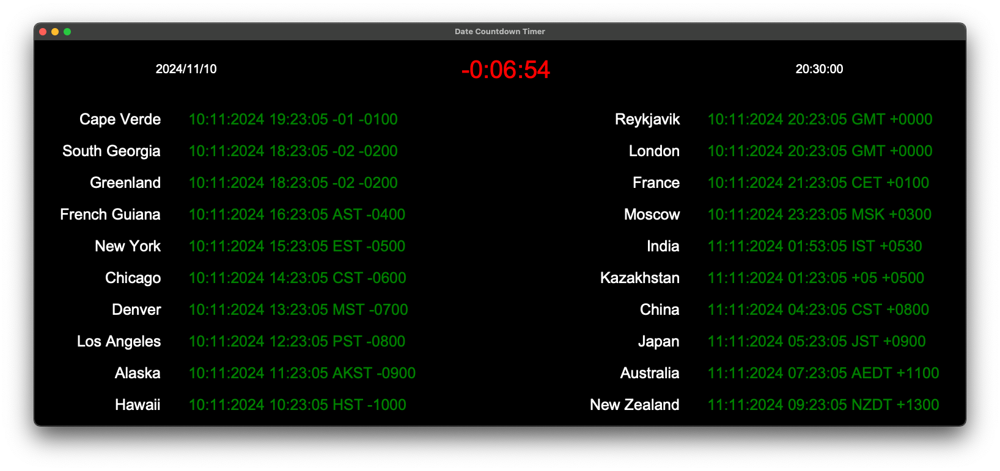

# Python Launch Count
## Date Counter
This program provides a date countdown/up. Although intended to be used for rocket launches or space related events, this can be used to display a count for any Date entered.



### Dependencies
* pytz


## Run
```bash
cd src
python3 count.py
```

## Usage
### Initial setup
On initial run of this program, if *any* of the required files aren't present, you will be asked to enter the required data for the file(s). These files will then be created with the data inputted.

### Date(s)
* The file `dates.txt` stores these dates.
* Format: `year,month,day,hour,minute,second`.
* Any number of dates can be entered (distinguished by a new line).
  * These dates are ordered on input.
* A line can be **commented out**, in either of the files, using a hashtag, `#`.

> [!note]
> If no date is entered, the program will just display the time zones.

### Time zone highlight
* The file `locations.txt` controls which time zones are highlighted.
* Any number of time zones can be entered (distinguished by a new line).

All possible values (case-insensitive):

|||
|--|--|
|Cape Verde|Reykjavic|
South Georgia|London|
Greenland|France|
French Guiana|Moscow|
New York|India|
Chicago|Kazakhstan|
Denver|China|
Los Angeles|Japan|
Alaska|Australia|
Hawaii|New Zealand|


#### Note
These files can be found in the `info/` directory.

### Keybinds
|Key|Description|
|--|--|
|Q|Quit program|
|F|Toggle fullscreen|
|Esc|Exit fullscreen|
|R|Recalculate font sizes , depending on the screen width|

---
### Example
Launch date from Cape Canaveral: 20 February 2020 at 13:15:18pm (local time)
<br/>
Text in dates.txt: `2020,2,20,13,15,18`
<br/>
Text in locations.txt (optional): `New York`

## License
Launch count is released under the Apache License 2.0. See LICENSE for details.
